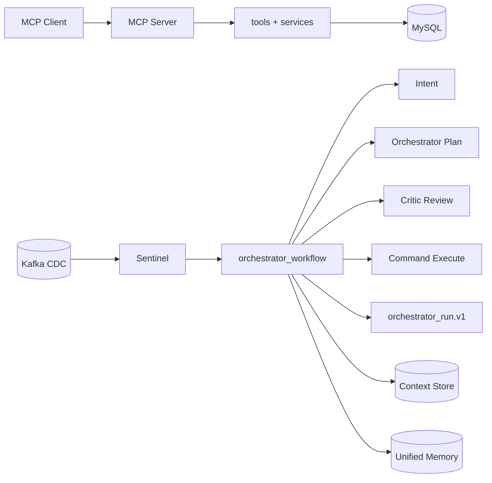

# 系统架构

本文档只描述当前代码已经落地的结构，不包含历史方案。

## 一分钟总览

项目由两条主链路组成：

- 交互式链路：MCP Client -> MCP Server -> tools/data_access
- 事件编排链路：Sentinel -> orchestrator_workflow -> 多角色协作 -> 结构化结果

## 代码入口

- 服务入口：[main.py](../main.py)
- MCP 服务实现：[server.py](../src/riskmonitor_multiagent/server.py)
- 编排主流程：[orchestrator_workflow.py](../src/riskmonitor_multiagent/orchestration/orchestrator_workflow.py)
- 工具执行与治理：[tool_executor.py](../src/riskmonitor_multiagent/orchestration/tool_executor.py)
- 工具元信息注册：[tool_registry.py](../src/riskmonitor_multiagent/orchestration/tool_registry.py)
- 上下文存储：[context_store.py](../src/riskmonitor_multiagent/orchestration/context_store.py)
- 统一记忆：[unified_memory.py](../src/riskmonitor_multiagent/memory/unified_memory.py)

## 编排流程

`run_orchestrator_workflow` 采用固定阶段推进：

1. 识别意图并写入 shared memory
2. Planner + Critic 计划评审循环
3. 执行 plan_steps 与 commands，产生 receipts
4. 再次计划修订直到收敛或到达轮次上限
5. Final + Critic 输出，构建 `orchestrator_run.v1`

最终产物重点字段：

- `intent`：意图识别结果
- `orchestrator_plan` / `critic_plan`：计划与评审
- `artifacts` / `receipts`：执行证据链
- `status`：`completed` 或 `pending_approval`
- `step_trace`：逐步 why + evidence 追踪
- `quality`：可解释性与契约指标

## 治理与安全

- 角色权限：通过 tool registry capability + target_agent 强约束
- side_effect 门禁：必须审批，未审批返回 `approval_required`
- 契约校验：关键输出通过 normalize/validate，异常写入 `schema_errors`
- 质量阻断：证据缺失或契约失败可进入 `pending_approval`

## 存储分层

- 短期上下文：Context Store（按 run_id 持久化）
- 工作记忆：Redis/SQLite（private/shared scope）
- 长期总结：Mongo run_summary（按 run_id upsert）
- 语义记忆：按开关写入 Chroma（默认关闭）

## 相关文档

- 快速开始：[QUICKSTART.md](./QUICKSTART.md)
- 数据与契约：[DATA.md](./DATA.md)
- 路线图：[ROADMAP.md](./ROADMAP.md)
