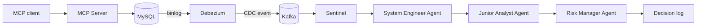
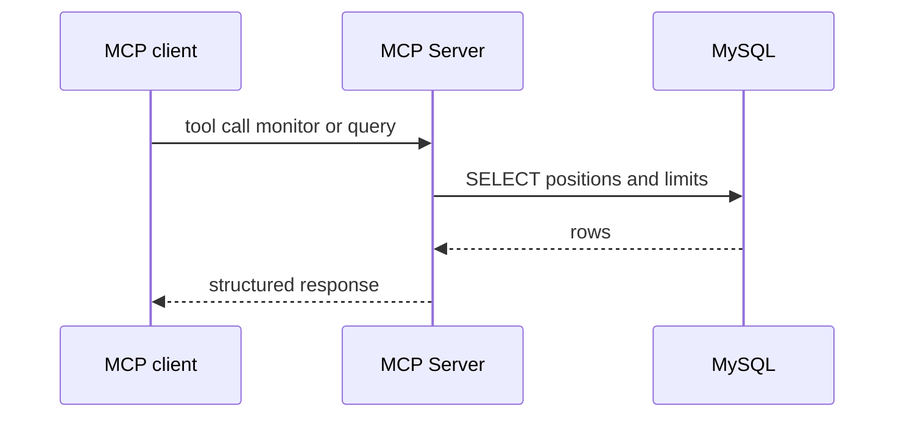
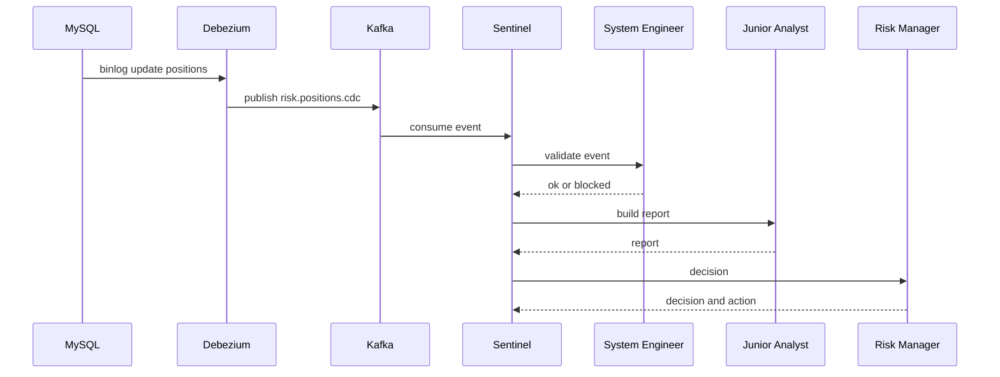

# 系统架构和技术特点

本项目现在有两条主链路  
一条是交互式问答链路 让 MCP 客户端按需查询和计算  
一条是事件驱动告警链路 让数据库变更自动触发哨兵和多智能体分析  

## 一分钟理解

你可以把它理解成一个风控操作系统  
Hands 是 MCP Server 负责查库和写库  
Nerves 是 CDC 负责把数据库变化变成事件  
Reflex 是 Sentinel 负责做第一层快速判断  
Brain 是 Multi Agent 负责写报告和给决策  

## 核心组件

### MySQL

保存 positions 和 alerts  
初始化脚本在 [init_db.sql](../scripts/init_db.sql)  

### MCP Server

对外提供 MCP tools 和 HTTP endpoints  
负责读写数据库并返回结构化结果  
入口在 [server.py](../src/riskmonitor_multiagent/server.py)  
对应的核心业务代码主要在 src/riskmonitor_multiagent/services  

### Kafka + Debezium

Debezium 订阅 MySQL binlog 并把 positions 的变化写入 Kafka topic `risk.positions.cdc`  
docker compose profile 为 infra  
connector 配置文件在 [positions-connector.json](../scripts/debezium/positions-connector.json)  

### Sentinel

Sentinel 是一个轻量消费者  
它从 `risk.positions.cdc` 读取事件  
做阈值检测 发现超限就触发多智能体流水线  
入口在 [service.py](../src/riskmonitor_multiagent/sentinel/service.py)  

### Multi Agent 三角色

System Engineer Agent  
先检查事件是否像技术问题 比如字段缺失 延迟过大  

Junior Analyst Agent  
把事件翻译成事实报告  

Risk Manager Agent  
给出决策和动作建议  

代码在 [agents](file:///Users/zhengchuan/Documents/TECH/Repo/RiskMonitor-MultiAgent/src/riskmonitor_multiagent/agents/)  
核心编排入口在 src/riskmonitor_multiagent/agents/pipeline.py  

### LLM OpenRouter

OpenRouter 客户端封装在 [openrouter_client.py](file:///Users/zhengchuan/Documents/TECH/Repo/RiskMonitor-MultiAgent/src/riskmonitor_multiagent/llm/openrouter_client.py)  
OpenRouter 客户端封装在 [openrouter_client.py](../src/riskmonitor_multiagent/llm/openrouter_client.py)  
当 LLM 不可用时 仍然会使用 fallback 结果保证链路可跑通  

## 数据流 1 交互式问答链路

适合按需查询 比如监控某个 desk 的 exposure  

## 数据流 2 事件驱动告警链路

适合自动化 只要数据库有变化 就会触发哨兵和多智能体  

## 现状与下一步

当前已完成  
- CDC topic 打通  
- Sentinel 消费并触发三角色流水线  
- 结果以日志形式输出  

下一步建议  
- Risk Manager 的 CRITICAL 决策写入 alerts 表  
- Junior Analyst 在生成报告前调用 MCP 的 monitor 工具拉取更多上下文  

## 关键入口一览

- Roadmap: [ROADMAP.md](ROADMAP.md)  
- Quickstart: [QUICKSTART.md](QUICKSTART.md)  
- Sentinel: [service.py](../src/riskmonitor_multiagent/sentinel/service.py)  
- Agents: [agents](../src/riskmonitor_multiagent/agents/)  
