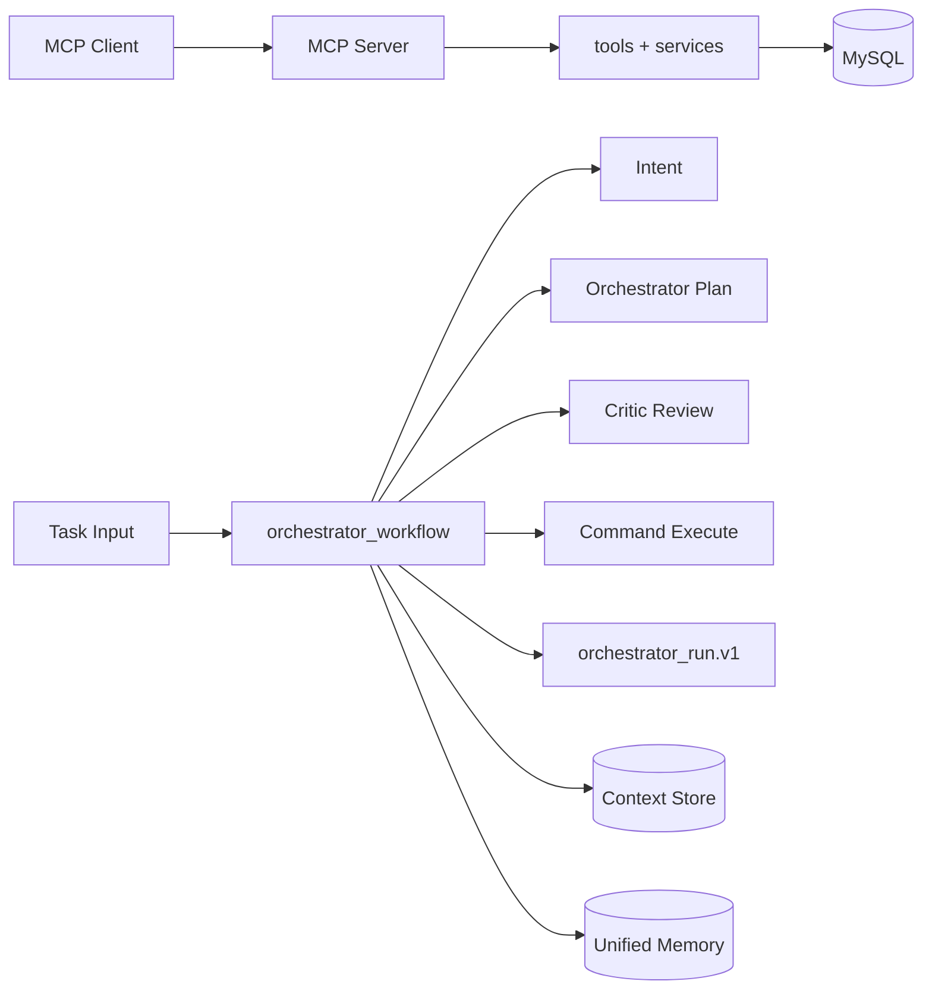

# 系统架构

本文档只描述当前仓库已落地能力

## 一分钟总览

系统由两条主链路组成

- 交互式链路 MCP Client -> MCP Server -> tools -> data_access
- 编排链路 task input -> intent -> plan review -> execute -> finalize

## 代码入口

- 服务入口 [main.py](../main.py)
- MCP 服务 [server.py](../src/riskmonitor_multiagent/server.py)
- 编排主流程 [orchestrator_workflow.py](../src/riskmonitor_multiagent/orchestration/orchestrator_workflow.py)
- 工具治理 [tool_executor.py](../src/riskmonitor_multiagent/orchestration/tool_executor.py)
- 工具元数据 [tool_registry.py](../src/riskmonitor_multiagent/orchestration/tool_registry.py)
- 上下文存储 [context_store.py](../src/riskmonitor_multiagent/orchestration/context_store.py)
- 统一记忆 [unified_memory.py](../src/riskmonitor_multiagent/memory/unified_memory.py)

## 编排流程

`run_orchestrator_workflow` 采用固定阶段推进

1. 识别意图并入状态与共享记忆
2. Planner + Critic 计划评审循环
3. 执行 plan_steps 和 commands 产出 receipts
4. 按轮次上限执行 replan 或收敛
5. Final + Critic 输出构建 `orchestrator_run.v1`

最终产物重点字段

- `intent` 意图识别结果
- `orchestrator_plan` 和 `critic_plan` 计划与评审
- `artifacts` 和 `receipts` 执行证据链
- `status` `completed` 或 `pending_approval`
- `step_trace` 逐步原因与证据引用
- `quality` 可解释性与契约质量指标

## 治理与安全

- 角色权限 通过 capability + target_agent 强约束
- side_effect 动作必须审批 未审批返回 `approval_required`
- 契约校验 使用 normalize + validate 失败写入 `schema_errors`
- 质量阻断 证据缺失或契约失败会触发 pending 状态

## 存储分层

- 短期上下文 Context Store 按 run_id 持久化
- 工作记忆 Redis 或 SQLite 支持 private 和 shared
- 长期总结 run_summary 按 run_id upsert
- 可选语义记忆 写入 Chroma 默认关闭

## 数据与契约

### MySQL 核心表

- `positions` 头寸基础数据
- `alerts` 风险告警持久化与检索
- 初始化脚本 [init_db.sql](../scripts/init_db.sql)

### 编排产物契约

- 总产物 `orchestrator_run.v1`
- Agent 输出契约 `orchestrator_output.v1` `critic_review.v1` `system_engineer_output.v1` `risk_analyst_output.v1`
- 意图契约 `intent_output.v2`
- 命令回执契约 `agent_command.v1` `agent_receipt.v1`

### 记忆契约

- 记忆条目 `memory_entry.v1` scope 仅支持 `private|shared`
- 长期总结 `run_summary.v1` 按 run_id 主键写入

## 相关文档

- 快速开始 [QUICKSTART.md](./QUICKSTART.md)
- 路线图 [ROADMAP.md](./ROADMAP.md)
- 评测手册 [../EVALUATION.md](../EVALUATION.md)
