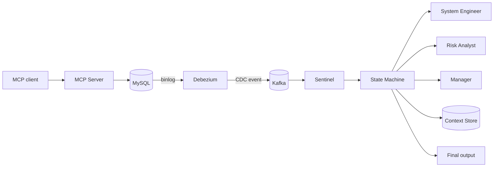
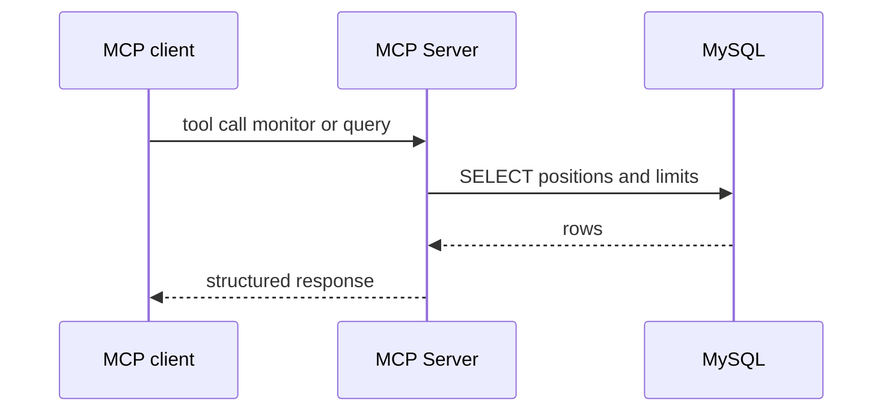
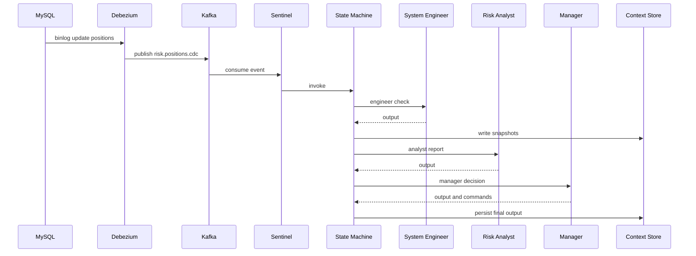

# 系统架构和技术特点

本项目现在有两条主链路  
一条是交互式问答链路 让 MCP 客户端按需查询和计算  
一条是事件驱动告警链路 让数据库变更自动触发哨兵和多智能体分析  

## 一分钟理解

你可以把它理解成一个风控操作系统  
Hands 是 MCP Server 负责查库和写库  
Nerves 是 CDC 负责把数据库变化变成事件  
Reflex 是 Sentinel 负责做第一层快速判断  
Brain 是状态机编排的 Multi Agent 负责写报告 给决策 下发指令并收集证据  

## 核心组件

### MySQL

保存 positions 和 alerts  
初始化脚本在 [init_db.sql](../scripts/init_db.sql)  

### MCP Server

对外提供 MCP tools 和 HTTP endpoints  
负责读写数据库并返回结构化结果  
入口在 [server.py](../src/riskmonitor_multiagent/server.py)  
对应的核心业务代码主要在 src/riskmonitor_multiagent/services  

### Kafka + Debezium

Debezium 订阅 MySQL binlog 并把 positions 的变化写入 Kafka topic `risk.positions.cdc`  
docker compose profile 为 infra  
connector 配置文件在 [positions-connector.json](../scripts/debezium/positions-connector.json)  

### Sentinel

Sentinel 是一个轻量消费者  
它从 `risk.positions.cdc` 读取事件  
做阈值检测 发现超限就触发状态机编排  
入口在 [service.py](../src/riskmonitor_multiagent/sentinel/service.py)  

### Multi Agent 三角色

System Engineer Agent  
先检查事件是否像技术问题 比如字段缺失 延迟过大  

Risk Analyst Agent  
把事件翻译成事实报告  

Manager Agent  
给出决策和动作建议  

代码在 [agents](../src/riskmonitor_multiagent/agents/)  
线性编排入口在 src/riskmonitor_multiagent/agents/pipeline.py  
状态机编排入口在 [state_machine.py](../src/riskmonitor_multiagent/orchestration/state_machine.py)  
状态机说明文档在 [STATE_MACHINE.md](STATE_MACHINE.md)  

### Tool governance Week11

本项目把 Agent 的工具调用当作受控执行  
核心目标是可控 可审计 可测试  

- Tool registry 统一维护 action 元数据与 capability 标签  
  - read_only side_effect pii admin  
  - 入口在 [tool_registry.py](../src/riskmonitor_multiagent/orchestration/tool_registry.py)  
- RBAC 强制执行在执行层  
  - system_engineer risk_analyst 只能执行 read_only  
  - manager 可以执行 side_effect 但必须审批  
  - 执行器入口在 [tool_executor.py](../src/riskmonitor_multiagent/orchestration/tool_executor.py)  
- 审批门禁在状态机与执行层双保险  
  - 状态机 HumanApproval 节点会对 side_effect commands 强制要求审批  
  - Execute 节点会把 approval 注入到 command params 供执行层校验  
- side effect 写库动作示例  
  - action write_alert 会调用 alerts_repository 写入 alerts 表  

### Knowledge Base

知识库使用向量数据库 Chroma  
Chroma 在 docker compose profile kb 中运行 对宿主机暴露端口 8001  
你可以用 make up-kb 启动向量库  
再用 make ingest-knowledge 从 alerts 表把最近告警写入向量库  
CLI 也可以用于排障 scripts/knowledge/kb.py query  
MCP tool search_similar_alerts 会读取 Chroma 并返回相似告警列表  

### LLM OpenRouter

OpenRouter 客户端封装在 [openrouter_client.py](../src/riskmonitor_multiagent/llm/openrouter_client.py)  
当 LLM 不可用时 仍然会使用 fallback 结果保证链路可跑通  

## 数据流 1 交互式问答链路

适合按需查询 比如监控某个 desk 的 exposure  

## 数据流 2 事件驱动告警链路

适合自动化 只要数据库有变化 就会触发哨兵和多智能体  

## 现状与下一步

当前已完成  
- CDC topic 打通  
- Sentinel 消费并优先触发状态机编排  
- Context Store 写入 run 轨迹 支持 replay  
- 状态机失败时自动 fallback 到线性流水线  
- Tool governance 基础版 capability RBAC approval gate  

下一步建议  
- Manager 输出必须引用 receipts evidence 并做契约门禁  
- 把最终结论摘要写入 Chroma 形成同步记忆闭环  
- 引入真实 HumanApproval 界面替换自动审批开关  

## 关键入口一览

- Roadmap: [ROADMAP.md](ROADMAP.md)  
- Quickstart: [QUICKSTART.md](QUICKSTART.md)  
- Sentinel: [service.py](../src/riskmonitor_multiagent/sentinel/service.py)  
- Agents: [agents](../src/riskmonitor_multiagent/agents/)  
