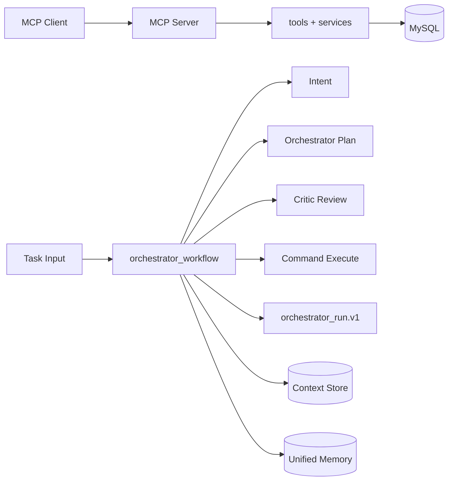

# 系统架构

本文档描述 RiskMonitor-MultiAgent 的完整架构，包括模块职责、边界划分与项目结构。

## 一分钟总览

系统由两条主链路组成：

- **交互式链路**：MCP Client → MCP Server → tools → data_access
- **编排链路**：task input → intent → plan review → execute → finalize



## 项目结构

```
项目根目录/
├── src/riskmonitor_multiagent/    # 业务核心代码
│   ├── agents/                    # Agent 角色定义
│   │   ├── base.py               # Agent 基类（LLM 交互封装）
│   │   └── roles.py              # 5 种 Agent 角色实现
│   ├── contracts/                 # 数据契约（验证与归一化）
│   │   ├── agent_outputs.py      # Agent 输出契约
│   │   ├── agent_messages.py     # 消息契约
│   │   ├── intent_output.py      # 意图输出契约
│   │   └── memory_entry.py       # 记忆条目契约
│   ├── orchestration/             # 编排工作流（LangGraph）
│   │   ├── orchestrator_workflow.py  # 主工作流
│   │   ├── tool_executor.py      # 工具执行器
│   │   ├── tool_registry.py      # 工具注册表
│   │   └── eval_adapter.py       # 评估适配器
│   ├── utils/                     # 公共工具函数 ⭐
│   │   ├── text.py               # 文本处理
│   │   ├── validation.py         # 验证工具
│   │   ├── json.py               # JSON 处理
│   │   ├── ids.py                # ID 生成
│   │   └── time.py               # 时间工具
│   └── ...                        # 其他模块
├── tests/                         # 功能测试
│   ├── unit/                      # 单元测试
│   └── integration/               # 集成测试
├── eval/                          # 效果评估流水线
├── scripts/                       # 便捷脚本
└── docs/                          # 文档
```

## 核心模块职责

### 1. Utils 包（公共工具）

集中管理各模块共享的通用函数：

| 模块 | 核心功能 | 使用场景 |
|------|----------|----------|
| `utils.text` | `clean_llm_output()`, `truncate_context()` | LLM 输出清理、上下文截断 |
| `utils.validation` | `is_non_empty_str()`, `has_evidence_refs()` | 数据验证 |
| `utils.json` | `safe_json_loads()`, `safe_json_dumps()` | JSON 安全处理 |
| `utils.ids` | `new_run_id()`, `new_command_id()` | ID 生成 |
| `utils.time` | `now_ms()`, `elapsed_ms()` | 时间计算 |

### 2. Contracts 包（契约验证）

定义数据格式规范，提供验证与归一化能力：

```python
from riskmonitor_multiagent.contracts import (
    validate_orchestrator_output,   # 验证输出是否符合契约
    normalize_orchestrator_output,   # 补充缺失字段为默认值
)

# 验证 Agent 输出
ok, errors = validate_orchestrator_output(output)

# 归一化（降级时填充默认值）
normalized = normalize_orchestrator_output(output)
```

### 3. Agents 包（Agent 定义）

5 种 Agent 角色，每种负责特定领域：

| Agent | 职责 | 关键输出 |
|-------|------|----------|
| `IntentAgent` | 意图识别 | 意图类型、风险等级、权限要求 |
| `OrchestratorAgent` | 编排计划 | plan_steps、commands |
| `CriticAgent` | 计划评审 | 风险等级、审批要求、改进建议 |
| `SystemEngineerAgent` | 系统分析 | 系统问题、根因、建议 |
| `RiskAnalystAgent` | 风险分析 | 业务影响、关键事实、置信度 |

### 4. Orchestration 包（编排逻辑）

使用 LangGraph 实现多 Agent 协作工作流：

```
┌─────────────┐    ┌─────────────┐    ┌─────────────┐    ┌─────────────┐
│ Intent Node │───→│  Plan Node  │───→│Execute Node │───→│Finalize Node│
│  (意图识别)  │    │(计划+评审循环)│    │  (步骤执行)  │    │ (最终汇总)  │
└─────────────┘    └──────┬──────┘    └─────────────┘    └─────────────┘
                          │
                    ┌─────▼─────┐
                    │Critic Node│
                    │  (评审员)  │
                    └───────────┘
```

## 代码入口

| 入口 | 文件路径 | 说明 |
|------|----------|------|
| 服务主入口 | `main.py` | 应用启动 |
| MCP 服务 | `server.py` | MCP 协议服务 |
| 编排主流程 | `orchestration/orchestrator_workflow.py` | LangGraph 工作流 |
| 工具治理 | `orchestration/tool_executor.py` | 命令执行与权限控制 |
| 工具注册 | `orchestration/tool_registry.py` | 工具元数据管理 |
| 上下文存储 | `orchestration/context_store.py` | 运行状态持久化 |
| 统一记忆 | `memory/unified_memory.py` | 记忆读写 |

## 编排流程详解

`run_orchestrator_workflow` 采用固定阶段推进：

1. **意图识别**：识别任务意图，写入共享记忆
2. **计划评审**：Planner 生成计划，Critic 评审，支持多轮修订
3. **步骤执行**：执行 plan_steps 和 commands，产出 receipts
4. **重规划**：按轮次上限执行 replan 或收敛
5. **最终汇总**：Final + Critic 输出构建 `orchestrator_run.v1`

最终产物关键字段：

- `intent` - 意图识别结果
- `orchestrator_plan` / `critic_plan` - 计划与评审
- `artifacts` / `receipts` - 执行证据链
- `status` - `completed` 或 `pending_approval`
- `step_trace` - 逐步原因与证据引用
- `quality` - 可解释性与契约质量指标

## 测试与评估边界

项目严格区分 **测试（Test）** 和 **评估（Evaluation）** 两大体系：

| 维度 | Test (`tests/`) | Evaluation (`eval/`) |
|------|-----------------|---------------------|
| **目的** | 检测功能是否正常工作 | 评估项目效果指标 |
| **触发时机** | 开发/CI 自动运行 | 发布/优化手动触发 |
| **判断标准** | 通过/失败 (Pass/Fail) | 指标数值 vs 阈值 |
| **输出** | 测试报告、覆盖率 | 指标汇总、质量门禁 |
| **运行命令** | `pytest tests/unit/` | `make eval-run` |

### 运行方式

**功能测试**：
```bash
pytest tests/unit/ -v              # 单元测试
pytest tests/integration/ -v       # 集成测试
make test                            # 全部测试
```

**效果评估**：
```bash
make eval-run RUN_TAG=experiment-1   # 运行评估
make eval-gate RUN_TAG=experiment-1    # 质量门禁检查
make eval-compare BASE=run1 CAND=run2  # 对比两次运行
```

### 评估指标体系

#### 传统质量指标

| 指标 | 说明 | 阈值 |
|------|------|------|
| `pass_rate` | 任务通过率 | > 0.9 |
| `step_reason_coverage` | 步骤理由覆盖率 | > 0.95 |
| `evidence_missing_rate` | 证据缺失率 | < 0.05 |
| `contract_fail_rate` | 契约失败率 | < 0.02 |
| `latency_ms_p95` | P95 延迟 | < 8000ms |
| `tokens_total` | Token 消耗 | < 50000 |

#### 协作过程指标（参照 GEMMAS/MultiAgentBench）

| 指标 | 全称 | 说明 | 阈值 |
|------|------|------|------|
| **IDS** | Information Diversity Score | 步骤间信息多样性 | > 0.3 |
| **UPR** | Unnecessary Path Ratio | 冗余路径占比 | < 0.5 |
| **Milestone** | Milestone Achievement Rate | 关键里程碑达成率 | > 0.75 |

### 边界原则

1. **测试模块不评估效果**
   - `tests/` 只验证功能正确性
   - 不计算 IDS、UPR 等效果指标
   - 不对指标做阈值判断

2. **评估模块不测试功能**
   - `eval/` 假设业务功能已正常工作
   - 不验证单个函数的正确性
   - 只收集和汇总运行指标

3. **单向依赖**
   ```
   tests/ ────────┐
                 ├──→ src/
   eval/ ─────────┘
            ↑
            │ (通过 eval_adapter.py 单一接口)
   ```

4. **业务侧仅暴露一个评估接口**
   ```python
   # orchestration/eval_adapter.py
   def workflow_output_to_eval_record(out, case_id, tags, config) -> dict:
       """将工作流输出转换为评估记录格式（唯一交互点）"""
   ```

## 治理与安全

### 权限控制

- **角色权限**：通过 `capability` + `target_agent` 强约束
- **副作用管控**：side_effect 动作必须审批，未审批返回 `approval_required`
- **契约校验**：使用 `normalize` + `validate`，失败写入 `schema_errors`
- **质量阻断**：证据缺失或契约失败触发 pending 状态

### 存储分层

| 存储类型 | 实现 | 用途 |
|----------|------|------|
| 短期上下文 | Context Store (文件) | 按 run_id 持久化运行状态 |
| 工作记忆 | Redis / SQLite | 支持 private 和 shared 作用域 |
| 长期总结 | MongoDB | 按 run_id upsert run_summary |
| 语义记忆 | Chroma (可选) | 默认关闭 |

## 数据契约

### MySQL 核心表

- `positions` - 头寸基础数据
- `alerts` - 风险告警持久化与检索
- 初始化脚本：`scripts/init_db.sql`

### 编排产物契约

| 契约名称 | 版本 | 说明 |
|----------|------|------|
| `orchestrator_run` | v1 | 总产物 |
| `orchestrator_output` | v1 | 编排器输出 |
| `critic_review` | v1 | 评审输出 |
| `system_engineer_output` | v1 | 系统工程师输出 |
| `risk_analyst_output` | v1 | 风险分析师输出 |
| `intent_output` | v2 | 意图识别输出 |
| `agent_command` | v1 | 命令格式 |
| `agent_receipt` | v1 | 回执格式 |

### 记忆契约

- `memory_entry` v1：scope 仅支持 `private|shared`
- `run_summary` v1：按 run_id 主键写入

## 代码规范

### 注释规范

- **文件头部**：模块说明文档字符串
- **类/函数**：docstring 说明用途、参数、返回值
- **关键逻辑**：行内注释解释原因

示例：
```python
def validate_orchestrator_output(output: dict[str, Any]) -> tuple[bool, list[str]]:
    """
    验证编排器 Agent 输出.

    检查项:
    - schema_version 有效性
    - plan_steps 格式与完整性
    - evidence 引用有效性

    Args:
        output: Agent 输出字典

    Returns:
        (是否通过, 错误列表)
    """
```

### 导入规范

```python
# 1. 标准库
from __future__ import annotations
import json
from typing import Any

# 2. 第三方库
from langgraph.graph import StateGraph

# 3. 本项目模块
from riskmonitor_multiagent.utils import is_non_empty_str
from riskmonitor_multiagent.contracts import validate_orchestrator_output
```

## 架构决策与设计

### ADR-001: LLM 调用缓存策略

**日期**: 2026-03-17  
**状态**: Accepted

**问题**: 当前系统 LLM 调用延迟高（P95: 153秒），token 消耗大（238,326 tokens/次），需要优化性能。

**决策**: 引入 LLM 调用缓存，使用纯内存 LRU 缓存策略。

**原因**:
- temperature=0 的请求是确定性的，可以安全缓存
- 纯内存实现简单，无额外依赖
- LRU 策略可以控制内存使用

**后果**:
- 正面：缓存命中时延迟大幅降低，Token 消耗减少
- 负面：内存占用增加（默认 1000 条），只对 temperature=0 的请求有效

---

### ADR-002: 输出自动修复策略

**日期**: 2026-03-17  
**状态**: Accepted

**问题**: 当前契约失败率 26.76%，主要原因是 LLM 输出 JSON 不稳定。

**决策**: 实现 3 层自动修复机制：
1. 直接解析 JSON
2. 从文本中提取 JSON（处理 ```json 包裹）
3. 修复常见 JSON 问题（尾随逗号、注释等）

---

### Phase 4 核心设计

#### 协作指标改进

**IDS (信息多样性)**:
- 多维度加权计算（角色多样性 30%、内容语义差异 30%、视角互补性 25%、输出完整性 15%）
- 过滤降级输出，给部分协作基础分

**Milestone (里程碑达成率)**:
- 每个里程碑检查输出质量（不只是存在性）
- Intent: 检查 primary_intent_type 非 "unknown" 且非降级
- Plan: 检查 plan_steps 有合理内容
- Execution: 检查 Engineer/Analyst 有实质性输出，或有 receipts/artifacts
- Finalize: 检查有 summary/output/conclusion

#### 多 Agent 协作模式

**1. 消息总线 (Message Bus)**:
- REQUEST/RESPONSE/BROADCAST 消息类型
- 支持订阅和通知
- 完整的消息历史记录

**2. 动态协作 (Dynamic Workflow)**:
- 状态机驱动，不是固定顺序
- Moderator 动态决定下一步
- 支持迭代和重规划

**3. 层次协作 (Hierarchical)**:
- 多层结构定义
- 任务分发和结果汇总
- 后台监控线程（真正的主动性）

**4. ReAct + CoT 推理范式**:
- Thought → Action → Observation 循环
- CoT 思维链（reasoning + evidence）
- BDI 模型（信念、愿望、意图）

---

## 相关文档

- 快速开始：[QUICKSTART.md](./QUICKSTART.md)
- 路线图：[ROADMAP.md](./ROADMAP.md)
