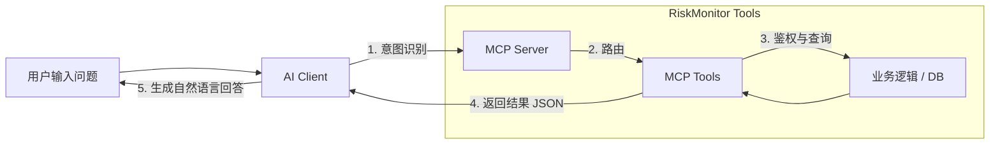
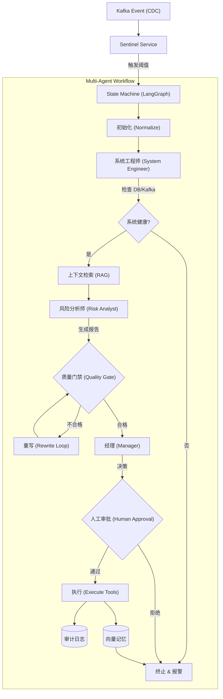

# 项目亮点与设计哲学 (HIGHLIGHTS)

本文档总结了 `RiskMonitor-MultiAgent` 项目的核心工作流设计、架构亮点以及对业界常见痛点的解决方案。

---

## 一、核心工作流 (Workflows)

本项目针对不同场景设计了两套完全独立的工作流，分别处理 **交互式查询** 和 **自动化风险治理**。

### 1. 场景一：用户主动提问 (Interactive Query)

当用户通过 AI 客户端 (如 Claude Desktop) 输入问题时，流程是 **同步且直接** 的。系统作为一个 MCP Server，直接响应用户的工具调用，不会触发复杂的多智能体状态机。

**流程特点**：同步、低延迟、单次请求-响应。



**关键代码**
所有的 MCP 工具入口都定义在 [mcp_tools.py](src/riskmonitor_multiagent/tools/mcp_tools.py) 中。

例如，查询某个 Desk 的风险敞口：
```python
# src/riskmonitor_multiagent/tools/mcp_tools.py

async def monitor_desk_exposure(
    desk: str,
    # ...
) -> dict:
    """
    监控 Desk 风险敞口 (核心工具).
    直接计算当前风险，不经过 Agent 状态机.
    """
    # 1. 鉴权
    if not is_authorized(get_headers_from_ctx(ctx)):
        return error_payload("UNAUTHORIZED", ...)

    # 2. 调用业务服务计算
    total_delta, total_pv_usd, by_currency = compute_exposure(positions, snapshot)

    # 3. 直接返回结果
    return {
        "desk": desk,
        "exposure": { ... },
        "alerts": formatted_alerts, # 包含是否违规的标记
        # ...
    }
```

### 2. 场景二：系统自动捕捉异常 (Autonomous Risk Monitoring)

当系统后台捕捉到异常 (如风险敞口超限) 时，会触发一个 **全自动、异步、带自我纠错** 的 Multi-Agent 状态机。

**流程特点**：异步、长运行、多角色协作、有状态持久化。

#### 流程图 (修复版)


#### 关键代码详解

**步骤 1: 触发 (Trigger)**
[sentinel/service.py](src/riskmonitor_multiagent/sentinel/service.py) 监听 Kafka 消息，发现异常即启动状态机。

```python
# src/riskmonitor_multiagent/sentinel/service.py

async def _process_message(self, msg):
    # ... 解析 payload ...
    if abs(exposure) > MAX_EXPOSURE_THRESHOLD:
        # 触发 Multi-Agent 状态机
        await run_state_machine(event=breach_event.to_dict())
```

**步骤 2: 状态机定义 (State Machine)**
[orchestration/state_machine.py](src/riskmonitor_multiagent/orchestration/state_machine.py) 使用 LangGraph 定义了节点流转。

```python
# src/riskmonitor_multiagent/orchestration/state_machine.py

def _build_graph():
    graph = StateGraph(_State)
    # 定义节点
    graph.add_node("engineer_check", _node_engineer_check)
    graph.add_node("risk_analyst", _node_risk_analyst)
    graph.add_node("quality_gate", _node_quality_gate)
    # ...
    
    # 关键逻辑：质量门禁不通过则重写
    graph.add_conditional_edges(
        "quality_gate", 
        _route_after_quality_gate, 
        {"rewrite": "rewrite", "manager": "manager"}
    )
    return graph.compile()
```

**步骤 3: 工程师检查 (System Engineer)**
确保基础设施正常，防止因数据库挂了导致的误报。

```python
# src/riskmonitor_multiagent/orchestration/state_machine.py

async def _node_engineer_check(state: _State) -> dict[str, Any]:
    # 调用 SystemEngineerAgent 分析系统指标
    result = await agent.analyze(event=state["event"], context={...})
    # 如果发现 system_issue=True，后续流程会被路由到 End
    return {"engineer": result.output}
```

**步骤 4: 质量门禁 (Quality Gate)**
这是系统的“反思”环节。如果分析师的置信度太低或没给证据，会被打回。

```python
# src/riskmonitor_multiagent/orchestration/state_machine.py

async def _node_quality_gate(state: _State) -> dict[str, Any]:
    analyst = state.get("analyst")
    # 规则检查
    if float(analyst.get("confidence")) < 0.4:
        gate_errors.append("confidence_too_low")
    
    # 决定是否重写 (最多重试 2 次)
    need_rewrite = len(gate_errors) > 0 and rewrite_count < 2
    return {"need_rewrite": need_rewrite, "errors": gate_errors}
```

**步骤 5: 执行与记忆 (Execute & Memory)**
执行经理的决策（如发邮件），并将本次处理的摘要写入向量库，形成长期记忆。

```python
# src/riskmonitor_multiagent/orchestration/state_machine.py

async def _node_execute(state: _State) -> dict[str, Any]:
    # 1. 执行命令 (Command)
    for cmd in commands:
        execute_agent_command(cmd)
        
    # 2. 写入记忆 (Memory) - 让系统"记住"这次事故的处理结果
    summary = f"event_id={event_id} decision={manager.get('decision')} ..."
    memory_store.upsert_alert(document=summary, ...)
    
    return {"final_output": ...}
```

---

## 二、Multi-Agent 系统痛点与解决方案

针对业界常见的 Multi-Agent 系统痛点，我们设计了以下解决方案：

### 1. 死循环与不可控 (Infinite Loops & Uncontrollability)

**问题**：Agent 之间互相推诿，或单个 Agent 陷入自我纠错的怪圈，导致任务无法结束。

**解决方案**：
*   **确定性状态机 (Finite State Machine)**
    使用 **LangGraph** 编排有向无环图 (DAG)，节点流转逻辑确定 (如 `Quality Gate` -> `Manager`)，结构上避免死循环。
    **Code Reference**: [state_machine.py](src/riskmonitor_multiagent/orchestration/state_machine.py) 定义了明确的图结构。

*   **最大重试次数 (Max Retry Limit)**
    在 `Quality Gate` 节点严格限制重写次数 (`rewrite_count < 2`)，防止无限重试。
    **Code Reference**: [state_machine.py](src/riskmonitor_multiagent/orchestration/state_machine.py)

*   **资源预算熔断 (Budget Enforcement)**
    引入 **Token Budget**、**Tool Budget** 和 **Time Budget**，预算耗尽立即终止执行。
    **Code Reference**: [state_machine.py](src/riskmonitor_multiagent/orchestration/state_machine.py)

### 2. 幻觉与信息失真 (Hallucination & Context Loss)

**问题**：信息传递失真，或 Agent 编造事实。

**解决方案**：
*   **RAG 与 Grounding (先检索后生成)**
    Analyst 分析前先运行 `retrieve_context` 节点，强制调用工具获取客观事实 (MySQL 健康状态、Kafka 延迟)，注入 Prompt。
    **Code Reference**: [state_machine.py](src/riskmonitor_multiagent/orchestration/state_machine.py)

*   **结构化输出与校验 (Schema Validation)**
    强制 JSON 格式输出，经 Pydantic/Schema 严格校验，拒绝模糊的自然语言回复。
    **Code Reference**: [validators.py](src/riskmonitor_multiagent/validation/validators.py)

*   **独立的评审角色 (Critic/Judge)**
    引入 `Quality Gate` 角色 (规则或 LLM-as-a-Judge) 交叉验证输出质量。
    **Code Reference**: [state_machine.py](src/riskmonitor_multiagent/orchestration/state_machine.py)

### 3. 协作开销与延迟 (Coordination Overhead)

**问题**：通信交互带来显著延迟，串行执行响应慢。

**解决方案**：
*   **并行工具调用 (Parallel Execution)**
    收集信息阶段并行执行 `collect_metrics`, `kafka_lag`, `mysql_health` 等工具，降低 I/O 延迟。
    **Code Reference**: [pipeline.py](src/riskmonitor_multiagent/agents/pipeline.py)

*   **共享状态对象 (Shared State Object)**
    维护全局 `_State` 字典在节点间传递，减少 Token 消耗并保证信息一致性。
    **Code Reference**: [state_machine.py](src/riskmonitor_multiagent/orchestration/state_machine.py)

### 4. 难以评估与调试 (Evaluation & Debugging)

**问题**：难以判断修改后系统表现的优劣。

**解决方案**：
*   **回放与对比测试 (Replay & Diff)**
    `ReplayVariant` 机制抓取历史事件重跑，自动对比 (Diff) 新旧结果差异。
    **Code Reference**: [replay_compare.py](src/riskmonitor_multiagent/governance/replay_compare.py)

*   **全链路审计 (Audit Trails)**
    关键决策和副作用操作持久化到 `audit_repository`，支持定量分析 (成功率、误报率)。
    **Code Reference**: [state_machine.py](src/riskmonitor_multiagent/orchestration/state_machine.py)

## 三、架构思考 (Trade-off)

我们在 **“单体全能 Agent” vs “精细化分工 Agent”** 之间选择了平衡的 **三角色模型 (Engineer/Analyst/Manager)**：
1.  **Engineer** 处理确定性硬指标。
2.  **Analyst** 处理非确定性推理。
3.  **Manager** 负责权责边界和决策。

这种分工既保证了专业性，又避免了过度拆分导致的系统碎片化。
