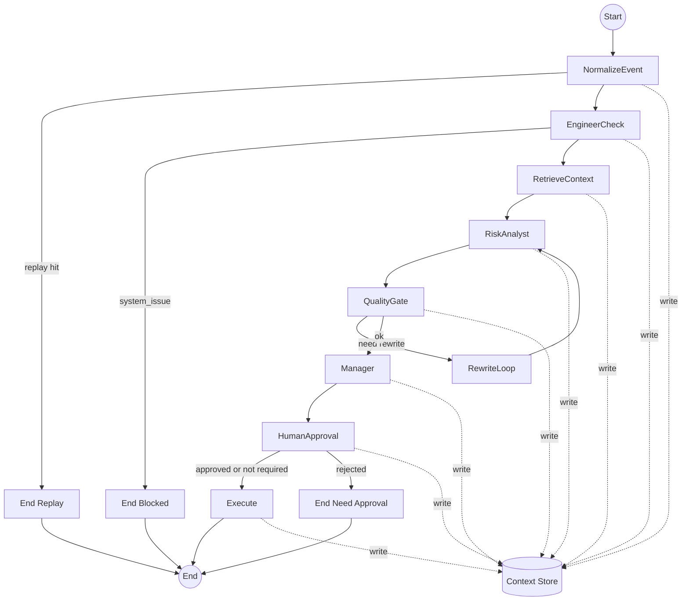

# State Machine

本项目的事件驱动链路现在用状态机来编排多智能体协作  
实现目标是可回放 可审计 可测试 可插入人工审批  
状态机入口代码在 [state_machine.py](../src/riskmonitor_multiagent/orchestration/state_machine.py)  
Sentinel 触发入口在 [service.py](../src/riskmonitor_multiagent/sentinel/service.py)  

## 状态机图

## 节点做什么

### NormalizeEvent
- 校验输入是否满足 RiskEvent 契约
- 生成 run_id 并写入 event_snapshot
- 如果同 event_id 已经有 final_output 则直接走 replay 返回历史结果

### EngineerCheck
- System Engineer 做确定性拦截
- 典型场景是事件字段不合法 事件延迟过高
- 命中 system_issue 就阻断后续 LLM 与工具调用

### RetrieveContext
- 这是观察与协作的核心节点
- 会生成 AgentCommand 并执行得到 AgentReceipt
- 目前默认会做
  - collect_metrics
  - kafka_lag
  - mysql_health
  - search_similar_alerts
- 同时会从 Chroma memory collection 检索历史 summary 作为 memory_hits
- receipts 与 rag hits 会写入 Context Store 供后续 Agent 引用

### RiskAnalyst
- Risk Analyst 读取 event 与共享上下文生成结构化事实报告
- 会把 receipts rag observations 注入到 payload._context 让 LLM 基于证据写报告

### QualityGate 与 RewriteLoop
- 校验 RiskAnalyst 输出 schema
- 检查 confidence 与 evidence 是否满足最低要求
- 不满足时最多重写 2 次 然后继续向下游推进

### Manager
- Manager 汇总 engineer analyst receipts 输出结构化决策
- Manager 可以产出 commands 列表 让执行器去反向调度其他 Agent

### HumanApproval
- 当 severity=CRITICAL 且 actionability=true 且 manager decision=CRITICAL 时触发审批
- 当前支持自动审批开关 便于本地回归

### Execute
- 执行 Manager 产出的 commands 并把新增 receipts 追加到 Context Store
- 产出 final_output 并持久化 用于 replay

## Context Store 黑板模型

Context Store 是共享上下文与同步记忆的最小实现  
当前实现是按 run_id 落一个 json 文件  
路径由 CONTEXT_STORE_DIR 控制 默认 data/context_store  
实现代码在 [context_store.py](../src/riskmonitor_multiagent/orchestration/context_store.py)  

写入内容包含
- event_snapshot
- engineer analyst manager outputs
- observations rag receipts
- approval
- final_output

## 同步记忆写入

状态机在 Execute 节点会把本次最终结论摘要写入 Chroma  
默认 collection 为 riskmonitor-memory 可用 CHROMA_MEMORY_COLLECTION 覆盖  

## Agent 协作对话格式

协作消息采用结构化 JSON  
Manager 下发 AgentCommand 其他 Agent 返回 AgentReceipt  
详细字段在 [DATA.md](DATA.md) 的 Agent 协作对话格式章节  
